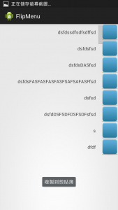
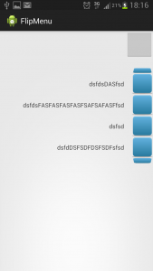

# Flip3dMenu(翻轉選單模組)

##開發動機
已往選單都少了動畫十分單調，希望透過動畫讓選單有趣與豐富

模組裡面有提供：

1.設定、item文字
2.設定、menu圖片

##示意圖

##使用說明

總共有三個語法

Step1.Creat

Step2.SetOnClickListener

Step3.Show

方法說明如下

1.FlipMenu(Context,ActivityLayout,ArrayList<HashMap<String, Object>>,TouchView)

    參數說明
    
    (1)
    Context:有繼承Context的Class通常為你的Activity
    ActivityLayout:Activity setContextView(thisClass)
    
    (2)
    ArrayList<HashMap<String, Object>>	
    HashMap<Key,Value>
    
    Set text key as "text"
    Set image key as "image"
    
    ArryList<Many HashMap<Many text & image>>傳入幾個便產生幾個項目
    
    (3)
    TouchView是你觸發FlipMenu的View(你按下哪個鈕想跳出我的FlipMenu的View)

2.setOnFlipMenu(OnFlipMenu onFlipMenu)

    OnFlipMenu	是我所建立的InterFace
    
3.flipMenu.show();

##顯示

###Code Eample:

flipMenu = new FlipMenu(MainActivity.this, mMainLayout, dataList, btn);

flipMenu.setOnFlipMenu(new OnFlipMenu() {
          
          @Override
          public void onClick(int index) {
            Log.e("index", index+"");
            
          }
});
flipMenu.show();

###ArrayList Example:

for (int i = 0; i <8; i++) {
  
  HashMap<String,Object> hashMap = new HashMap<String, Object>();
  
  switch (i) {
    case 0:
      
      hashMap.put("text", "dsfdssdfsdfsdffsd");
      hashMap.put("image", R.drawable.stop256);
      
      break;
    case 1:
      hashMap.put("text", "dsfdsfsd");
      hashMap.put("image", R.drawable.stop256);				
      break;
                
    case 2:
      hashMap.put("text", "dsfdsDASfsd");
      hashMap.put("image", R.drawable.stop256);
      break;
      
    case 3:
      hashMap.put("text", "dsfdsFASFASFASFASFSAFSAFASFfsd");
      hashMap.put("image", R.drawable.stop256);
      break;
      
    case 4:
      hashMap.put("text", "dsfsd");
      hashMap.put("image", R.drawable.stop256);
      break;
      
    case 5:
      hashMap.put("text", "dsfdDSFSDFDSFSDFsfsd");
      hashMap.put("image", R.drawable.stop256);
      break;
      
    case 6:
      hashMap.put("text", "s");
      hashMap.put("image", R.drawable.stop256);
      break;
      
    case 7:
      hashMap.put("text", "dfdf");
      hashMap.put("image", R.drawable.stop256);
      break;
      
    

    default:
      break;
  }
  
  dataList.add(hashMap);
  
}

